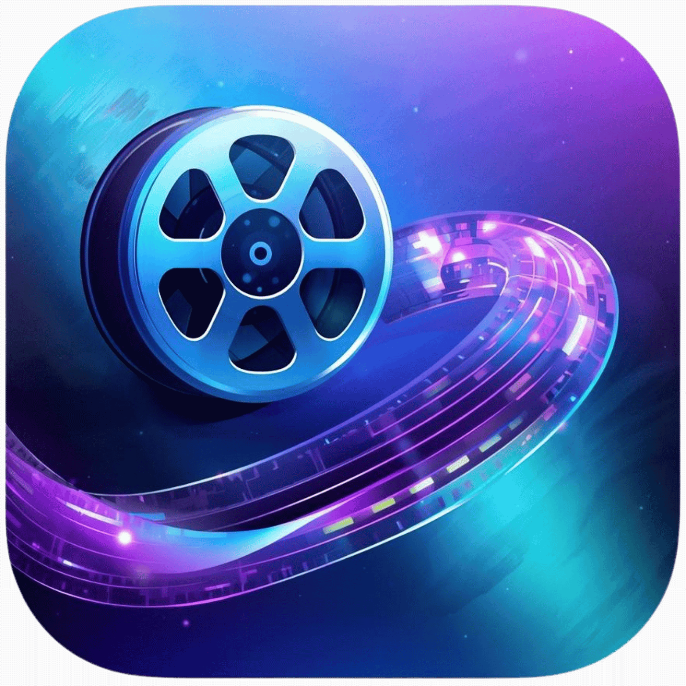
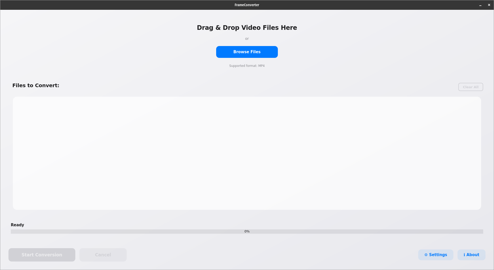
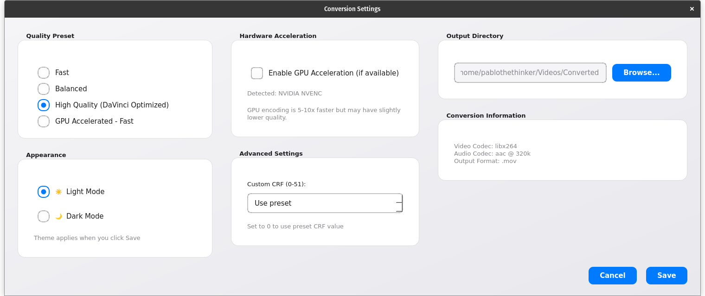
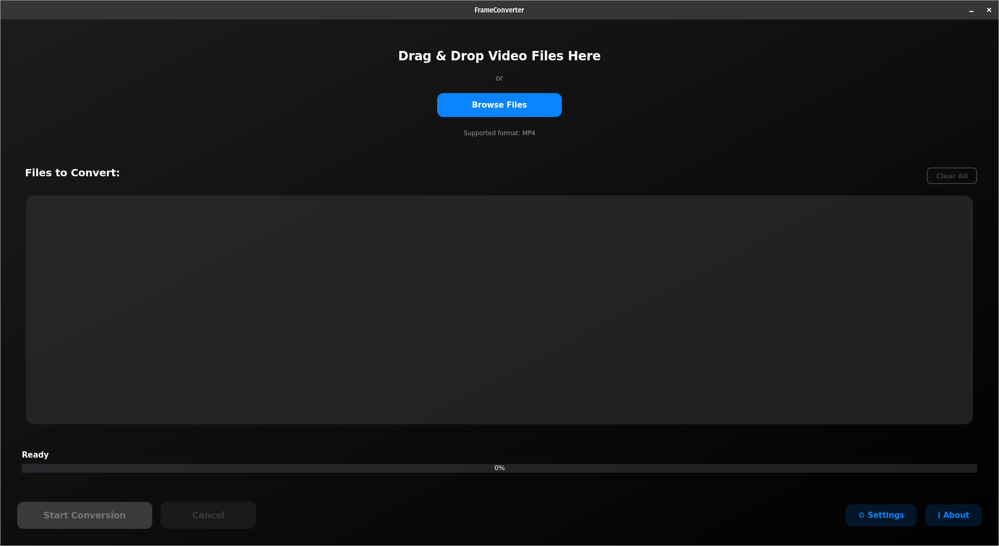

# FrameConverter

<div align="center">



**A beautiful, modern video converter for DaVinci Resolve**

Convert MP4 videos to MOV format with an Apple-inspired interface

[](https://www.python.org/downloads/)
[](https://www.riverbankcomputing.com/software/pyqt/)
[](LICENSE)

</div>

## ✨ Features

- 🎨 **Modern UI** - Beautiful Apple-inspired design with glassmorphism effects
- 🌓 **Light & Dark Mode** - Choose your preferred theme
- 🖱️ **Drag & Drop** - Simply drag your video files into the app
- ⚡ **GPU Acceleration** - Supports NVIDIA NVENC, Intel QSV, and AMD VAAPI
- 📊 **Real-time Progress** - See conversion progress and bitrate in Mbps
- 🎯 **Quality Presets** - Fast, Balanced, High Quality, or GPU Accelerated
- 📦 **Batch Processing** - Convert multiple videos at once
- ⚙️ **Advanced Settings** - Custom CRF values for fine-tuned control
- 🚀 **DaVinci Resolve Optimized** - Perfect MOV files for video editing

## 📸 Screenshots

### Main Window


### Settings Dialog


### Dark Mode


## 🚀 Quick Start

### Prerequisites

- **Python 3.8+**
- **FFmpeg** (for video conversion)

### Installation

#### Ubuntu / Debian / Pop!_OS

```bash
# Install system dependencies
sudo apt install ffmpeg python3 python3-pip git

# Clone the repository
git clone https://github.com/pablothethinker/frameconverter.git
cd frameconverter

# Install Python dependencies
pip3 install -r requirements.txt

# Run the application
python3 src/main.py
```

#### Fedora

```bash
# Install system dependencies
sudo dnf install ffmpeg python3 python3-pip git

# Clone the repository
git clone https://github.com/pablothethinker/frameconverter.git
cd frameconverter

# Install Python dependencies
pip3 install -r requirements.txt

# Run the application
python3 src/main.py
```

#### Arch Linux

```bash
# Install system dependencies
sudo pacman -S ffmpeg python python-pip git

# Clone the repository
git clone https://github.com/pablothethinker/frameconverter.git
cd frameconverter

# Install Python dependencies
pip3 install -r requirements.txt

# Run the application
python3 src/main.py
```

### Optional: Create Desktop Shortcut

For easy access, you can create a desktop application entry:

```bash
# Run the install script
chmod +x install.sh
./install.sh
```

This will create a desktop icon and menu entry for FrameConverter.

## 📖 Usage

1. **Launch FrameConverter**
   ```bash
   python3 src/main.py
   ```

2. **Add Videos**
   - Drag & drop MP4 files into the window, OR
   - Click "Browse Files" to select videos

3. **Configure Settings** (Optional)
   - Click the ⚙ Settings button
   - Choose quality preset (Fast, Balanced, High Quality, GPU Accelerated)
   - Select light or dark theme
   - Enable GPU acceleration if available
   - Set custom output directory

4. **Start Conversion**
   - Click "Start Conversion"
   - Monitor real-time progress and bitrate
   - Converted files are saved to `Videos/Converted` by default

5. **Cancel Anytime**
   - Click "Cancel" to stop conversion gracefully

## ⚙️ Configuration

### Quality Presets

| Preset | CRF | Encoding Speed | File Size | Quality |
|--------|-----|----------------|-----------|---------|
| **Fast** | 23 | Very Fast | Small | Good |
| **Balanced** | 20 | Fast | Medium | Great |
| **High Quality** | 17 | Medium | Large | Excellent |
| **GPU Accelerated** | 23 | Very Fast | Small | Good |

### Hardware Acceleration

FrameConverter automatically detects your GPU and enables acceleration:

- **NVIDIA** - NVENC encoder
- **Intel** - QuickSync (QSV) encoder
- **AMD** - VAAPI encoder

GPU encoding is **5-10x faster** but may have slightly lower quality than CPU encoding.

### Advanced Settings

- **Custom CRF** - Set your own quality value (0-51, lower = better)
- **Output Directory** - Choose where converted files are saved
- **Theme** - Switch between light and dark mode

## 🏗️ Project Structure

```
frameconverter/
├── src/
│   ├── main.py                    # Application entry point
│   ├── ui/
│   │   ├── main_window.py         # Main application window
│   │   ├── settings_dialog.py    # Settings configuration
│   │   ├── about_dialog.py        # About dialog with credits
│   │   ├── drop_zone.py           # Drag & drop widget
│   │   ├── file_list_widget.py    # File list display
│   │   └── progress_widget.py     # Progress and stats display
│   ├── converter/
│   │   ├── ffmpeg_wrapper.py      # FFmpeg integration
│   │   ├── conversion_worker.py   # Background processing
│   │   └── video_info.py          # Video file analysis
│   ├── utils/
│   │   ├── config.py              # App configuration
│   │   └── logger.py              # Logging setup
│   └── resources/
│       ├── styles.qss             # Light mode stylesheet
│       ├── styles_dark.qss        # Dark mode stylesheet
│       └── app_icon.png           # Application logo
├── requirements.txt               # Python dependencies
├── install.sh                     # Linux installation script
├── LICENSE                        # MIT License
└── README.md                      # This file
```

## 🎨 Design Philosophy

FrameConverter follows **Apple Human Interface Guidelines** with:

- **8pt Grid System** - Consistent spacing throughout
- **Glassmorphism** - Semi-transparent UI elements with blur
- **Smooth Animations** - Polished, responsive interactions
- **Clear Typography** - SF Pro Display font family
- **Accessibility** - High contrast, readable text
- **Modern Color Palette** - #007AFF blue, #34C759 green

## 🔧 Technical Details

### Video Conversion

**Default Settings:**
```bash
ffmpeg -i input.mp4 \
  -c:v libx264 -preset medium -crf 17 \
  -c:a aac -b:a 320k \
  -movflags +faststart \
  -pix_fmt yuv420p \
  output.mov
```

**With GPU Acceleration (NVIDIA):**
```bash
ffmpeg -hwaccel cuda -i input.mp4 \
  -c:v h264_nvenc -preset fast -cq 23 \
  -c:a aac -b:a 320k \
  -movflags +faststart \
  -pix_fmt yuv420p \
  output.mov
```

### File Size Estimates

With CRF 17 (High Quality) encoding:

| Duration | Resolution | File Size (Approx) |
|----------|------------|-------------------|
| 30 min | 1080p | 1.5-2.5 GB |
| 1 hour | 1080p | 3-5 GB |
| 2 hours | 1080p | 6-10 GB |
| 30 min | 4K | 4-7 GB |
| 1 hour | 4K | 8-14 GB |

*Actual sizes vary based on video complexity and motion*

## 🔒 Security

FrameConverter is built with security as a priority:

- ✅ **No Command Injection** - All FFmpeg commands use argument lists (not shell strings)
- ✅ **Path Traversal Protection** - All file paths are sanitized and validated
- ✅ **Input Validation** - File types, sizes, and permissions are checked
- ✅ **No Network Access** - Fully offline application, no data collection
- ✅ **Timeouts & Limits** - All operations have appropriate resource limits
- ✅ **Safe Subprocess Handling** - Processes can be safely cancelled

For more details, see [SECURITY.md](SECURITY.md).

### Reporting Security Issues

If you discover a security vulnerability, please follow responsible disclosure:
- **Contact privately**: DM on X/Twitter [@pablothethinker](https://x.com/pablothethinker)
- **Don't publish** until a fix is available
- See [SECURITY.md](SECURITY.md) for full details

## 🤝 Contributing

Contributions are welcome! Please feel free to submit a Pull Request.

1. Fork the repository
2. Create your feature branch (`git checkout -b feature/AmazingFeature`)
3. Commit your changes (`git commit -m 'Add some AmazingFeature'`)
4. Push to the branch (`git push origin feature/AmazingFeature`)
5. Open a Pull Request

## 📝 License

This project is licensed under the MIT License - see the [LICENSE](LICENSE) file for details.

## 👨‍💻 Author

**Pablo** - Creator & Developer

- X/Twitter: [@pablothethinker](https://x.com/pablothethinker)
- Company: Kyron Industries

## ☕ Support

If you find FrameConverter useful, consider buying me a coffee!

[](https://buymeacoffee.com/pablothethinker)

## 🙏 Acknowledgments

- **FFmpeg** - The amazing multimedia framework powering conversions
- **PyQt6** - Beautiful Qt framework for Python
- **Apple HIG** - Design inspiration for the modern interface
- **DaVinci Resolve** - The professional video editor this tool supports

## 📋 Changelog

### v1.0.0 (2025-11-02)
- Initial release
- Modern Apple-inspired UI
- Light and dark mode themes
- GPU acceleration support
- Drag & drop interface
- Real-time progress tracking
- Quality presets (Fast, Balanced, High Quality, GPU)
- Batch conversion support
- Desktop application integration

## 🐛 Known Issues

None at this time! Report bugs via GitHub Issues.

## 🗺️ Roadmap

- [ ] Video preview before/after conversion
- [ ] Support for more input formats (AVI, MKV, WebM)
- [ ] Trim/cut functionality
- [ ] ProRes codec support
- [ ] Apple Silicon optimization
- [ ] Windows and macOS versions
- [ ] Preset saving/loading
- [ ] Conversion history

---

<div align="center">

Made with ❤️ by Pablo @ Kyron Industries

⭐ Star this repo if you find it useful!

</div>
